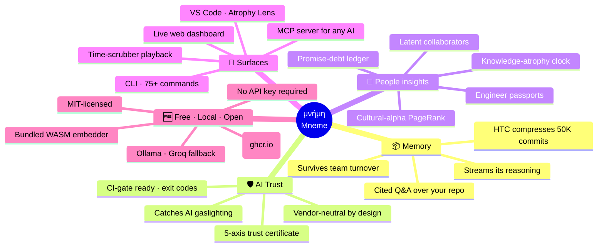

<div align="center">

<h1>μνήμη · Mneme</h1>

<p><b><i>What your codebase already knows.</i></b></p>

<p>
  Pronounced <code>NEE-meh</code> · Greek for "memory"<br/>
  <sub>sister of Lethe (forgetting), mother of the muses.</sub>
</p>

<p>
  <a href="https://www.npmjs.com/package/mneme-ai"></a>
  
  
  
  
  <a href="https://registry.modelcontextprotocol.io/"></a>
  <a href="https://github.com/patsa2561-art/mneme-ai/stargazers"></a>
  <a href="https://patsa2561-art.github.io/mneme-ai/"></a>
  
  <a href="https://github.com/patsa2561-art/mneme-ai/pkgs/container/mneme-ai"></a>
</p>

<h2><i>Code outlives its authors.<br/>Memory should too.</i></h2>

<p>
  The bug came back. The fix is buried in a commit from 2022. <i>The author left.</i><br/>
  <b>Mneme finds it in 50ms</b> — with the diff, the rationale, and the related commits.
</p>

<p>
  <i>The same memory feeds your AI through MCP. With citations.</i>
</p>

<br/>


</div>

═══════════════════════════════════════════════════════════════════════════════

## 🗺 What Mneme is, in one picture



> *Five pillars · one center · everything you read below is one of these branches told in detail.*

═══════════════════════════════════════════════════════════════════════════════

## ⏱ The 60-second story

You ship code with an AI assistant. The AI is brilliant — it reads syntax, infers types, autocompletes whole files. But there are **three things even the best AI cannot do**:

1. 🧠 **Remember why the code exists.** Six years of decisions, deprecations, and "we tried that, it broke X" — none of it is in the AI's context window.
2. 🔍 **Verify its own claims.** AI confidently says "no change to db.ts" — the diff shows three lines in db.ts. You merge. Production breaks.
3. 🛡 **Tell you when *another* AI is gaslighting you.** With multiple AI assistants all touching `git log`, **who is grading the homework?**

**Mneme is the layer underneath.** It's what gives your AI a memory. It's what verifies citations. And it's what audits every AI-driven commit with a vendor-neutral 5-axis trust certificate.

```bash
npm install -g mneme-ai             # zero-setup, bundled WASM, no API key
cd <any git repo>
mneme index                         # ~90s for 5k commits — one time

mneme ask "why does parseAmount use try/catch?"   # cited answer · refuses if unverifiable
mneme do "find security issues"                   # smart dispatcher · multi-step
mneme audit --certify                             # grades the AI's homework
```

**The result your AI tools didn't know they were missing.** When Mneme is plugged in via MCP, your AI's answers get *measurably more grounded* — every claim cited, every contradiction caught, every AI commit certified before it merges.

> 🎯 **Mneme isn't another AI assistant.** It's the **memory layer underneath** whatever AI you already use. Plug it in once via MCP; every tool that talks to it gets measurably more grounded.

### Before / With — what changes the moment Mneme is in your repo

| Scenario | Without Mneme | With Mneme |
|---|---|---|
| 🔍 *"Why does this code exist?"* | AI guesses from syntax | Cited answer with the original PR + rationale |
| 🤖 *AI says "no change to db.ts"* but diff edits db.ts | Merges silently | `mneme audit --certify` blocks the PR (exit 1) |
| 🛡 *AI commits 400 lines at 04:00 UTC* | Reviewed like any other PR | Forensic axes flag time + size anomaly |
| 📦 *50,000-commit monorepo + Sonnet 1M* | "context window exceeded" | HTC compresses to ~1.5M tokens, fits comfortably |
| 🆓 *No OpenAI/Anthropic key* | Tool refuses to work | Bundled WASM + free Ollama/Groq path runs full Q&A |

📅 [Full release history](https://github.com/patsa2561-art/mneme-ai/wiki/Releases) · [CHANGELOG](https://github.com/patsa2561-art/mneme-ai/blob/main/CHANGELOG.md)

═══════════════════════════════════════════════════════════════════════════════

## 🌟 Spotlight — `mneme audit`

> *Catches your AI assistant lying about its own commits — before the lie reaches `main`.*

### The 30-second story

Your AI commits this:

> *"Refactored the handler. **No changes to db.ts.**"*

But the diff shows three new lines in `db.ts`. Tests still pass. You almost click merge.

That's the moment **`mneme audit --certify`** runs and stops you:

```
⚠  AI said:    "No changes to db.ts"
   Reality:    db.ts modified (+3 -0)
   Verdict:    contradicted ✗

   ⊘ FAIL  (exit code 1 → your CI blocks the PR)
```

One sentence in the commit message vs. the actual diff. That's the gap. Mneme reads both, side-by-side, every time.

### How to use it (3 lines, copy-paste)

```bash
mneme audit --baseline   # before letting your AI loose, take a snapshot
# ↓ AI works, commits, pushes ↓
mneme audit --certify    # grade the homework — pass / warn / fail + exit code
```

Drop into any CI in one line ([GitHub Actions](https://github.com/patsa2561-art/mneme-ai/wiki/Integrations) · GitLab · Bitbucket · CircleCI · Jenkins). Default verdict is *fail* on contradiction so a bad PR can't merge by accident.

<details>
<summary><b>📖 What gets checked + why we don't lie</b></summary>

**Five things — each scored independently, each verifiable from raw git data:**

| # | What we check | The plain question |
|---|---|---|
| 1 | 🎯 Did the same commands still work? | Run `mneme status` / `npm test` before vs after. Same output? |
| 2 | 📐 Did any public type / function disappear? | Diff the exported API surface. |
| 3 | ✅ Did any test that used to pass now fail? | Compare test results before vs after. |
| 4 | ⚡ Did anything get noticeably slower? | Median latency baseline vs current. >25% slower = fail. |
| 5 | 📰 Does the commit message match the diff? | Parse claims like "no change to X". Check vs the diff. |

**Plus forensic axes** (the same anomaly engine that grades human commits): time-of-day · which files touched · style of code · size. Applied to **whoever's name is on the commit** — any AI tool, you, your teammate, your dog. We don't care what tool produced the commit — we only check what the commit claims vs what it actually changed.

**Why we don't lie:**

- *"No change to db.ts"* is checkable → we mark it `contradicted` only when the diff says otherwise
- *"Improved overall reliability"* is **not** checkable → we mark it `unverifiable` and move on
- We never invent a verdict an LLM dreamed up. Every conclusion ties back to a hash + line number you can read.

The output is a 5-axis JSON certificate. Stable shape. Drop into your CI gate, your dashboard, your compliance audit. SOX / SOC2 review-ready.

### All six modes (you only need `--certify` 90% of the time)

```bash
mneme audit --baseline    # snapshot before the AI works
mneme audit --trace       # see what the AI did + which AI did it
mneme audit --verify      # narrative-vs-diff check, no scoring
mneme audit --certify     # the full 5-axis cert + exit code
mneme audit --watch       # continuous gate (re-runs every N seconds)
mneme audit --report      # markdown trail for compliance archives
```

Add `--explain` to any of them to get a plain-English narrative on top, generated by your local free-LLM ladder ([setup-free](https://github.com/patsa2561-art/mneme-ai#-free-forever--no-api-key-required) wizard, 30 seconds).

</details>

→ **[Full guide · CI snippets · compliance · honest limits →](https://github.com/patsa2561-art/mneme-ai/wiki/AI-Session-Audit)**

═══════════════════════════════════════════════════════════════════════════════

## 📝 Spotlight — VS Code extension

> **The codebase whispers; the editor listens.** *No competitor ships this signal inline.*

<details>
<summary><b>📖 Atrophy Lens — knows which functions still live in someone's head, inline</b></summary>

The headline is the **Atrophy Lens** — a one-line plain-English code lens above every function and class:

```
🟢 fresh — last expert touched 6 days ago (98%)
export function buildPassport(store, opts) { … }

🟡 fading — top knower 41% fresh, last touched 198 days ago — refresh recommended
export class TokenBucket { … }

🔴 ghost — no live expert, deep history lost (4 prior touches)
function legacyMigrationStep() { … }
```

You scroll a file and **instantly know** which functions still live in someone's head. No charts. No dashboards. Just the truth, inline.

The extension also surfaces:

- **Sidebar tree** — last audit verdict, top 5 at-risk files, your own author passport.
- **Status-bar badge** — `pass / warn / fail / idle` from the latest 5-axis audit.
- **Palette commands** — `Mneme: Ask…`, `Mneme: Why this line`, `Mneme: Audit current PR`, `Mneme: Open Nervous System`.
- **Hover provider** — top-knower preview as you mouse over symbols.

</details>

→ **[Install · settings · privacy →](https://github.com/patsa2561-art/mneme-ai/wiki/VS-Code-Extension)**

═══════════════════════════════════════════════════════════════════════════════

## 🧬 Spotlight — People analytics (the flagship)

> **Six commands for what GitHub cannot see — plus one PDF a CTO frames.** *Local. Private. Honest about its own limits.*

<details>
<summary><b>📖 What GitHub's contributor count cannot see</b></summary>

- 🧠 **Latent collaborators** — pairs who never co-author but rhyme behaviorally
- ⏳ **Knowledge atrophy** — who still remembers what (Ebbinghaus decay)
- 👑 **Cultural alphas** — whose patterns spread (PageRank, volume-independent)
- 📜 **Promise debt** — every "I'll fix this later" tracked + verified
- 🌳 **Semantic ownership** — whose interpretation lives in this code now

```bash
mneme telepathy             # invisible teams
mneme atrophy               # knowledge half-life heatmap
mneme influence             # cultural alphas (PageRank)
mneme promise               # promise-debt ledger
mneme lineage src/auth.ts   # semantic ownership of a function
mneme passport alice@       # one engineer's full dossier
mneme nervous-system --pdf  # FLAGSHIP — combined PDF report
```

**The flagship — `mneme nervous-system`.** Combines passport + telepathy + atrophy + influence + repo neuroanatomy + an honest limits panel. Outputs: terminal summary, self-contained HTML, opt-in PDF (`--pdf`, lazy-loads puppeteer-core). The PDF a CTO prints for the board meeting. **Privacy-first**: all data is local. Defamation-safe: nemesis section is opt-in only via `--include-friction`.

</details>

→ **[Full positioning + examples → People Analytics wiki](https://github.com/patsa2561-art/mneme-ai/wiki/People-Analytics)**<br/>
→ **[Flagship PDF → Mneme Nervous System wiki](https://github.com/patsa2561-art/mneme-ai/wiki/Mneme-Nervous-System)**

═══════════════════════════════════════════════════════════════════════════════

<div align="center">

<table>
<tr>
<td align="center" width="100%">

### 🌐 Try the Live Dashboard — *no install required*

<sub>Interactive · time-scrubbable · 100% local-first · zero backend</sub>

<br/>

<a href="https://patsa2561-art.github.io/mneme-ai/">
  
</a>

<br/><br/>

**🎬 Click "Try the demo"** to load a 7-author synthetic team · **📥 drop your own JSON** to see your repo (parsed in browser, never uploaded) · **🎞 drag the time scrubber** to watch your team's invisible network form across years.

<sub>📖 [How it works · install · usage · privacy → Web Dashboard wiki](https://github.com/patsa2561-art/mneme-ai/wiki/Web-Dashboard)</sub>

</td>
</tr>
</table>

</div>

═══════════════════════════════════════════════════════════════════════════════

## 🌐 Spotlight — The Live Dashboard

> **Drag the time scrubber. Watch your codebase grow.** *No git tool has temporal nervous-system playback. Mneme does.*

The dashboard renders the same `nervous-system` data your CLI prints — as an interactive force-directed graph, an atrophy heatmap, and a PageRank influence ladder. The headline innovation is the **Time Scrubber**: drag it to rewind the repo, watch authors fade in, telepathy edges form, knowledge atrophy refresh. Everything stays in your browser.

🔗 **Live demo:** https://patsa2561-art.github.io/mneme-ai/

```bash
mneme dashboard          # opens localhost in your browser, pointed at your repo
```

<details>
<summary><b>📖 What ships in v0.30 — three views, three input modes, zero upload</b></summary>

**Three views (toggle in the header)**

| View | What it shows |
|---|---|
| 🧬 **Nervous System** | Force-directed graph. Authors as nodes (size = knowledge mass, color = atrophy state), telepathy as edges. Click a node → full passport. |
| ⏳ **Atrophy heatmap** | Files × authors matrix. Cell shaded by knowledge score. Hover for who-knew-when. |
| 👑 **Influence ladder** | PageRank ranking. Each row expands to show originated patterns + adopter count. |

**The Time Scrubber — the headline innovation**

Drag the slider in the header to rewind the codebase. The graph re-positions in real time:

- Authors who joined later fade in at their `fromDate`
- Telepathic edges form / dissolve as their events come into view
- Atrophy is **recomputed** at the scrubbed timestamp (not "now" minus a constant)
- Click ▶ for a 12-second timelapse from earliest commit to today

**Three input modes (click "Load")**

1. 🎬 **Try the demo** — bundled `demo.json`, renders instantly.
2. 📥 **Drop a file** — drag-drop or file picker. `mneme nervous-system --json > out.json`, then drop. **No upload.**
3. 🔗 **From URL** — paste a hosted JSON URL (CORS permitting).

**Local-first, by construction**

- The hosted demo is a static SPA — no backend, no telemetry.
- `mneme dashboard` spins up a localhost server and reads your `.mneme/mneme.db` directly. Data never leaves the box.
- Bundle is tree-shaken D3 + React, sub-500KB gzipped.

</details>

→ **[Open the live demo →](https://patsa2561-art.github.io/mneme-ai/)**

═══════════════════════════════════════════════════════════════════════════════

## 🧠 The brain — five lobes (click any to expand)

Mneme's intelligence is split into 5 cognitive modules. Each is independently useful and composable. **Click a lobe to see how it thinks.**

<details>
<summary><b>📦 Hierarchical Memory (HTC)</b> — compress 50,000 commits into one Claude prompt · <i>world-first compression-as-storage</i></summary>

Every AI codebase tool today is **retrieval-only**. They search your repo at query time and dump raw text into the LLM. That breaks at scale.

Mneme inverts the model: at index time, **free LLMs (Groq Gemma 2B / Ollama Qwen) walk every commit** and produce three layers of compression:

| Layer | Size per unit | What it stores |
|---|---|---|
| Layer 1 — abstracts | ~30 tok / commit | per-commit "WHAT changed + WHY" |
| Layer 2 — clusters | ~100 tok / cluster | topic-level summaries |
| Layer 3 — memoir | ~500 tok | repo-evolution narrative |

Token math on a 50K-commit repo:

```
raw commit text     ~50M tokens   (won't fit anywhere)
compressed cache    ~1.5M tokens  (fits in Sonnet 1M context, comfortably)
compression ratio   ~33×
```

```bash
mneme htc-build        # one-time compression (~10 min for 5k commits, free LLM)
mneme htc-stats        # see coverage + compression ratio
```

**Used automatically by `mneme ask` when cache is built.** AI clients via MCP get compressed responses by default — `compress: false` to opt back into raw. ~10× fewer tokens per session.

→ [[Wiki: Hierarchical-Memory]](https://github.com/patsa2561-art/mneme-ai/wiki/Hierarchical-Memory)

</details>

<details>
<summary><b>🔬 Speculative Reasoning</b> — see Mneme think · verify every claim · DDTree commit-tree search</summary>

Most "AI codebase tools" are black boxes — input goes in, answer comes out, you trust the output. Mneme inverts this: every commit considered, every claim verified, every prune explained.

```bash
mneme ask "why was JWT chosen?" --stream
```

Output streams events in real time:

```
⚙ consider abc1234  "auth: switch session → JWT"        score 0.84
✓ accept   abc1234  above score floor
⚙ consider def5678  "auth: add CSRF guard"               score 0.41
✗ prune    def5678  below topK cut
✦ synthesize from 2 verified citations…
✓ verify    "JWT was chosen for stateless tokens"   ✓ matches PR #482 body
✗ verify    "session storage caused issues at scale" ⚠ unverifiable claim
✓ done      in 312ms
```

**Five primitives ship together:**
1. Streaming events — `consider / accept / prune / contradict / verify`
2. **Leviathan citation verifier** — adapted from the speculative-decoding paper. Every claim's hash + sentence verified against evidence. Unverified claims wrapped `[unverified: ...]`.
3. **DDTree commit-tree search** — best-first ancestor exploration with budget + depth caps
4. **ConstraintPruner trait** — pluggable validators (CWE / ENFSI / 4-axis / custom)
5. **Path-aware sessions + wisdom-mutant** — Q2 search constrained by Q1's commits; provider success rates auto-evolve

→ [[Wiki: Speculative-Reasoning]](https://github.com/patsa2561-art/mneme-ai/wiki/Speculative-Reasoning)

</details>

<details>
<summary><b>⚡ Super Pipeline + MPE math</b> — deeply-pipelined-superscalar engine · 1.56× throughput · novel formula</summary>

Modern CPUs combine deep pipelining (~20 stages, fast clock) with superscalar (multiple parallel pipelines). Mneme brings the same architecture to its retrieval flow — and adds a self-tuning trust eigenvector no other CLI tool ships.

**The novel math (MPE — Multi-stage Pipelined Eigentrust):**

```
T_n = α × E_n × T_{n-1} + (1-α) × prior

  E_n[s] = exp(-latency / target)   on success
  E_n[s] = 0                         on failure
  α      = 0.85   (PageRank decay)
  prior  = 1/N    (uniform exploration)
```

Combines **Eigentrust** (Kamvar et al. 2003) + **PageRank decay** + **Bayesian online updates** + **pipeline scheduling**. After ~20 production calls, T converges to a stable per-stage trust ranking. Pipeline auto-allocates more workers to high-trust slow stages, fewer to low-trust ones, disables speculative pre-fetch when trust is unsafe.

**Throughput benchmark** (4-stage pipeline, 8 inputs, 12ms/stage):

```
sequential (width=1, buffer=1) = 168 ms
pipelined  (width=2, buffer=4) = 108 ms
speedup                        = 1.56×
```

→ [[Wiki: Super-Pipeline]](https://github.com/patsa2561-art/mneme-ai/wiki/Super-Pipeline)

</details>

<details>
<summary><b>🛡 Guardian + AI Audit</b> — 24/7 self-healing · always-on pre-commit hook · vendor-neutral AI session audit</summary>

**Three layers of "always-on" protection:**

1. **Guardian** — 24/7 self-healing daemon. Diagnoses index drift, weak embeddings, schema staleness; auto-fixes safe items, recommends the rest.
   ```bash
   mneme guardian --watch --apply --interval 300
   ```

2. **`mneme guard`** — pre-commit hook. Install once → blocks commits with hardcoded secrets or CWE-aligned vulnerability patterns. <300ms per commit. Bypass with `git commit --no-verify`.
   ```bash
   mneme guard --install
   ```

3. **`mneme audit`** — AI Session Audit. **Vendor-neutral** trust certificate for every AI-driven commit. Works with any AI tool whose commits end up in `git log`.
   ```bash
   mneme audit --baseline      # snapshot before AI works
   #  → AI does its thing →
   mneme audit --certify       # 5-axis pass/warn/fail · CI-friendly exit code
   ```

   The 5 axes: **behavioral parity · API contract drift · test pass rate · perf regression · AI narrative match**. Plus reuses Mneme's forensic anomaly engine (TIME / FILES / STYLE / SIZE) on AI commits.

→ [[Wiki: Guardian]](https://github.com/patsa2561-art/mneme-ai/wiki/Guardian) · [[Wiki: AI-Session-Audit]](https://github.com/patsa2561-art/mneme-ai/wiki/AI-Session-Audit)

</details>

<details>
<summary><b>🔬 Forensic Code Science</b> — Bayesian author attribution · ENFSI verbal scale · CWE vuln hunt · insider-threat anomaly</summary>

Real forensic-science methodology applied to git history — not a metaphor. **Bayesian likelihood ratios** (Did Alice really write this commit?). **ENFSI 2015 verbal scale** (the same standard used in court). **11 CWE-aligned** vulnerability classes. **4-axis insider-threat detection** (TIME × FILES × STYLE × SIZE). Built for bank / finance / regulated-industry engineering oversight.

```
LR = 3.87e-13   (~1 in 2.6 trillion — overwhelming AGAINST authorship)
                 EXTREMELY STRONG SUPPORT AGAINST
```

Every output is plain-English with a `HEADS UP` warning when the repo is too small / single-author for statistically meaningful forensics — no false-positive theater.

→ **[Full forensic toolkit + CWE classes + ENFSI scale → Wiki](https://github.com/patsa2561-art/mneme-ai/wiki/Forensic-Code-Science)**

</details>

═══════════════════════════════════════════════════════════════════════════════

## 📖 The library, not the librarian

> Every great library has two kinds of people: brilliant minds who borrow books, and a quiet archive that remembers everything.

Most coding AIs position themselves as the brilliant mind — bigger model, faster inference, longer context. They compete on the same axis: who is the smartest student in the room.

**Mneme isn't another student. Mneme is the archive.**

We don't compete with the AI in your editor. We give it the **memory layer** it never had — every decision, every deprecation, every "we tried that, it broke X" — fed back through MCP, with citations.

Practical consequence: every Mneme release makes **every AI tool that plugs in** measurably more grounded. Lift the floor across the whole ecosystem instead of fighting for one chair.

→ [How the memory layer works → Wiki](https://github.com/patsa2561-art/mneme-ai/wiki/AI-Teacher)

═══════════════════════════════════════════════════════════════════════════════

## 💎 The Frontier — 28+ capabilities no other tool ships

After researching the landscape, every command in our Frontier table occupies whitespace where **no maintained, open-source, local-first tool ships this capability today.**

→ 🗺 **[5-min Architecture Overview](https://github.com/patsa2561-art/mneme-ai/wiki/Architecture-Overview)** *(start here)* · 📋 **[Full table of world-firsts](https://github.com/patsa2561-art/mneme-ai/wiki/The-Frontier)**

<details>
<summary><b>🆕 What shipped in v0.36 → v0.43</b> — click to expand</summary>

### v0.40-v0.43 — Element / Atom / Molecule architecture

A chemistry-inspired layer **under** the 75 existing commands.

- **v0.40 — [Periodic Table](https://github.com/patsa2561-art/mneme-ai/wiki/Periodic-Table)** — 15 elements + 5 atoms + 2 molecules + browsable catalog at `mneme periodic-table`
- **v0.41 — [Compose & Compiler](https://github.com/patsa2561-art/mneme-ai/wiki/Compose-And-Compiler)** — `mneme compose "<intent>"` plans a custom pipeline; rule-based by default, `--llm` for refinement
- **v0.42 — [Second Brain](https://github.com/patsa2561-art/mneme-ai/wiki/Second-Brain)** — `mneme library` records every plan; frequent ones auto-promote to named aliases; `mneme run <alias>` executes via sandbox-aware executor
- **v0.43 — [Holy Grails](https://github.com/patsa2561-art/mneme-ai/wiki/Holy-Grails)** — `mneme heartbeat` (codebase as living being), `mneme rewind <commit>` (time-travel debug), `mneme dna-fold` (team-DNA emerges)

### v0.37 — Bayesian-filtered security scanner + 6 new rules

Vulnerability scanner rewritten around a **stack-aware Bayesian prior × AST evidence score**. Findings whose `posterior = prior × evidence` falls below threshold are dropped before they leave the scanner — the "16 false-positive CWE-89 in a NestJS+Mongoose repo" goes to **zero** because the SQL prior collapses on a NoSQL stack.

New: `mneme forensics vulns --sarif` (GitHub Code Scanning) · `--explain` · `mneme show <finding-id>` · `mneme suppress <id>` · `mneme audit --verify-head` · 6 new rules (missing-auth-guard / mass-assignment / IDOR / SSRF / prototype-pollution / weak-webhook-signature).

### v0.36 — five Originals

`mneme karma` (TODO debt as flow ledger) · `mneme repo-mri` (20-axis z-scored health) · `mneme palimpsest --counterfactual` (what did this line lock in?) · `mneme cognitive-twin` (stylometric voice + rewriter) · `mneme conscience --dual-jury` (prosecution + defense + verdict).

→ **[Deep-dive each Original](https://github.com/patsa2561-art/mneme-ai/wiki/Originals)**

</details>

### 🛡 What Mneme is NOT

Mneme is **a memory layer**, not a SAST replacement. The vulnerability scanner is a high-precision *secondary* check — it catches what an attacker would find by reading 5 years of history. **Pair it with CodeQL / Semgrep / Snyk; don't replace them.**

> 🛡 *Built to complement existing AI coding assistants — not to replace them.*

═══════════════════════════════════════════════════════════════════════════════

## 🚀 Install

<details>
<summary><b>Pick the path that matches your machine</b></summary>

### 🟢 The happy path — works on Mac (Intel + Apple Silicon), Linux x64/arm64, Windows x64

```bash
# Need Node 22 LTS first. If you don't have it: https://nodejs.org/en/download
node --version          # → must be v22.x or later
npm install -g mneme-ai
```

Then on any git repo:

```bash
cd <any git repo>
mneme init
mneme index             # ~90s for 5k commits, zero-setup (bundled WASM)
mneme ask "why does X exist?"
```

### 🐳 The universal path — works *everywhere*, no Node toolchain needed

If `npm install -g mneme-ai` fails on your machine (Windows ARM, Node 24, missing Python / Visual Studio Build Tools, corporate proxy, etc.) — use Docker. Same Mneme, ~90 MB image, multi-arch:

```bash
docker pull ghcr.io/patsa2561-art/mneme-ai:latest

# index + query in one shot:
docker run --rm -v "$PWD:/repo" ghcr.io/patsa2561-art/mneme-ai:latest mneme index
docker run --rm -v "$PWD:/repo" ghcr.io/patsa2561-art/mneme-ai:latest mneme ask "why does X exist?"
```

Make a shell alias if you'll use it daily:

```bash
# Mac / Linux
alias mneme='docker run --rm -v "$PWD:/repo" ghcr.io/patsa2561-art/mneme-ai:latest mneme'
```

```powershell
# Windows PowerShell
function mneme { docker run --rm -v "${PWD}:/repo" ghcr.io/patsa2561-art/mneme-ai:latest mneme @args }
```

→ **[Full Docker guide → Wiki](https://github.com/patsa2561-art/mneme-ai/wiki/Docker)**

### 🔬 The zero-install preview — see the dashboard before you commit to anything

Open the live demo (no install, no signup, no upload):

**[https://patsa2561-art.github.io/mneme-ai](https://patsa2561-art.github.io/mneme-ai)**

Drag-drop your repo's `mneme nervous-system --json` output onto the page — parsed in your browser, never sent to a server.

### 🛠 The contributor path

```bash
git clone https://github.com/patsa2561-art/mneme-ai.git
cd mneme-ai
npm install
npm run build
node packages/cli/bin/mneme.js --help
```

### 📋 Compatibility matrix

| Your setup | Recommended path | Why |
|---|---|---|
| 🍎 macOS (Intel or Apple Silicon) + Node ≥ 22 | `npm install -g mneme-ai` | prebuilt binaries cover this |
| 🐧 Linux x64 / arm64 + Node ≥ 22 | `npm install -g mneme-ai` | prebuilt binaries cover this |
| 🪟 Windows x64 + Node 22 LTS | `npm install -g mneme-ai` | prebuilt binaries cover this |
| 🪟 **Windows ARM64** *(Surface, Copilot+ PCs)* | `npm install -g mneme-ai` | ✅ *(fixed in v0.34 — zero native compile)* |
| 🪟 **Node 24+ on any OS** | `npm install -g mneme-ai` | ✅ *(fixed in v0.34 — node:sqlite ships with Node)* |
| 🏢 Corporate / air-gapped CI | **🐳 Docker** | no npm reachability needed once image pulled |
| 🆕 Just want to look around | **Live demo URL** | zero commitment |

### 🔧 Common install errors — what to do

<table>
<tr><th>Error</th><th>Why it happens</th><th>Fix</th></tr>
<tr><td><code>gyp ERR! find Python</code> · <code>node-gyp rebuild</code> failures</td><td>Your Node version doesn't have a prebuilt <code>better-sqlite3</code> binary, so npm tries to compile from source — needs Python + C++ build tools</td><td>Use the 🐳 Docker path. Or: install Node 22 LTS (most prebuilts cover it) and retry.</td></tr>
<tr><td><code>EBUSY: resource busy or locked, rmdir 'node_modules\sharp'</code></td><td>An earlier install left files locked by an editor / antivirus</td><td>Close VS Code + file explorer in <code>%AppData%\npm</code>. Retry. If it persists, <code>rm -rf $(npm root -g)/mneme-ai</code> and try Docker.</td></tr>
<tr><td><code>prebuild-install warn install No prebuilt binaries found (target=24.x …)</code></td><td>Native deps haven't shipped Node 24 prebuilts yet (it's brand new)</td><td>🐳 Docker is the cleanest fix. Or <code>nvm install 22.11.0 &amp;&amp; nvm use 22.11.0</code> then retry.</td></tr>
<tr><td><code>EACCES: permission denied</code> on global install</td><td>Default npm prefix points at a system path</td><td>Either set up <a href="https://docs.npmjs.com/resolving-eacces-permissions-errors-when-installing-packages-globally">a user-owned npm prefix</a> or use <code>sudo npm install -g mneme-ai</code> (Mac/Linux).</td></tr>
<tr><td>Stuck in "compiling…" for 5+ minutes</td><td>node-gyp is compiling from source — slow and fragile</td><td>Cancel (<kbd>Ctrl-C</kbd>) and use 🐳 Docker.</td></tr>
</table>

### 🔄 Upgrade

```bash
mneme upgrade            # bulletproof self-update — bypasses npm cache + PATH conflicts
```

For Docker:

```bash
docker pull ghcr.io/patsa2561-art/mneme-ai:latest
```

</details>

<details>
<summary><b>🆓 Free Forever — no API key required</b></summary>

Indexing works zero-config (bundled WASM, ~25MB auto-download).

For full Q&A synthesis, run the 30-second wizard:

```bash
mneme setup-free
```

Three free paths:

| Path | What you get | Setup time |
|---|---|---|
| 🏠 **Local Ollama** | 100% private, free forever, ~3GB one-time | ~3 min |
| ⚡ **Groq free tier** | 500 tok/s cloud (fastest), generous free quota | ~30 sec |
| 🌐 **OpenRouter free** | Model variety: Qwen, Gemma, Llama 3.3 | ~30 sec |

**Auto-detected.** Set `GROQ_API_KEY`, `OPENROUTER_API_KEY`, `TOGETHER_API_KEY`, or run local `ollama serve` — Mneme picks the right path. **Models known to work free:** Llama 3.3 70B · Qwen 2.5 (3B/7B/72B) · Qwen QwQ 32B · Gemma 2 (2B/9B) · Llama 3.1/3.2.

If everything fails, retrieval-only fallback still answers — never a hard error.

</details>

═══════════════════════════════════════════════════════════════════════════════

## ⚡ Try it

<details>
<summary><b>Five commands to start</b></summary>

```bash
mneme ask "why does parseAmount use try/catch?"
#  → verdict-shaped answer, citation-grade

mneme why src/auth.ts:47
#  → who wrote each line + why · semantically related commits

mneme premortem "swap event-bus library"
#  → predict regret risk grounded in YOUR repo (not generic best-practices)

mneme story "rate-limiting"
#  → narrative across all commits touching the topic

mneme ask --audit "..."
#  → zero-hallucination mode · refuses if confidence below floor
```

</details>

<div align="center">

<table>
<tr>
<td align="center" width="100%">

### 📚 The full command browser — **50+ commands, every one with examples**

<sub>Tier 1 essentials · Forensics · Quant · Insights · MCP · Audit</sub>

<br/>

[**🔍 Browse all commands in the wiki →**](https://github.com/patsa2561-art/mneme-ai/wiki/Command-Tour)

<sub>plain-English use case · copy-paste examples · graphics · grouped by category</sub>

</td>
</tr>
</table>

</div>

<details>
<summary><b>🤖 Tell your AI to install it (one prompt)</b></summary>

Copy-paste this into any AI client that supports MCP:

```
Install mneme-ai globally with npm, then run `mneme init` and `mneme index`
in this repo. Then add the Mneme MCP server to your config so you can call
`mneme_ask`, `mneme_search_commits`, `mneme_why`, and `mneme_status` as
tools. The MCP transport is stdio; the command is `mneme mcp` from this
repo's root.
```

The AI will figure out the rest (npm install, MCP config edits, smoke-test). Works because Mneme is **registered in the official MCP Registry**.

</details>

═══════════════════════════════════════════════════════════════════════════════

## ❓ FAQ

<details>
<summary><b>Common questions (click to expand)</b></summary>

**Q: Can I just prompt my AI agent to run `git log` instead?**
A: Yes — for small repos with simple queries. Mneme starts adding value when **scale, semantics, forensics, or audit** matter — see [the comparison table](https://github.com/patsa2561-art/mneme-ai/wiki/Innovations#vs-ai--git-cli) for the 9 cases.

**Q: Does Mneme replace my AI coding assistant?**
A: No. Mneme is a **memory layer underneath them**. Plug Mneme's MCP server into your AI client and it gains semantic codebase memory + forensic tools.

**Q: Do I need Ollama or an OpenAI key?**
A: No. Bundled WASM model handles indexing zero-config. For full Q&A synthesis, `mneme setup-free` walks you through 3 free paths in 30 seconds.

**Q: Does my code leave my machine?**
A: No. Indexing + retrieval are **100% local**. Only your AI client (if cloud-based) sees what *you* decide to send it.

**Q: How accurate is the forensic analysis?**
A: Pattern matching produces **candidates**, not certified findings — every hit needs human review. Forensic methodology follows the **ENFSI 2015 verbal scale** (real forensic standard). See [Forensic-Code-Science](https://github.com/patsa2561-art/mneme-ai/wiki/Forensic-Code-Science).

**Q: Will it work on a 50,000-commit monorepo?**
A: Yes. Indexing is incremental. With `mneme htc-build` the entire history fits in one Claude prompt as compressed abstracts.

**Q: What if I'm offline / on a plane?**
A: After the first run (one-time 25MB model download), everything works offline. Hash fallback works even without the bundled model.

</details>

═══════════════════════════════════════════════════════════════════════════════

## 📦 Project links

<table>
<tr><td>📦 <b>npm</b></td><td><a href="https://www.npmjs.com/package/mneme-ai">npmjs.com/package/mneme-ai</a></td></tr>
<tr><td>💻 <b>GitHub</b></td><td><a href="https://github.com/patsa2561-art/mneme-ai">github.com/patsa2561-art/mneme-ai</a></td></tr>
<tr><td>📚 <b>Wiki</b></td><td><a href="https://github.com/patsa2561-art/mneme-ai/wiki">Mneme's brain map</a></td></tr>
<tr><td>📋 <b>CHANGELOG</b></td><td><a href="https://github.com/patsa2561-art/mneme-ai/blob/main/CHANGELOG.md">version-by-version detail</a></td></tr>
<tr><td>🔌 <b>MCP Registry</b></td><td><code>io.github.patsa2561-art/mneme-ai</code></td></tr>
</table>

═══════════════════════════════════════════════════════════════════════════════

## 📜 License

MIT. Use it. Fork it. Ship it.
Quoting [Christensen](https://www.harvardbusiness.org/its-easier-to-hold-to-your-principles-100-of-the-time-than-it-is-to-hold-to-them-98-of-the-time/):

> *"It's easier to hold your principles 100% of the time than it is to hold them 98% of the time."*

Mneme's principles are non-negotiable: local-first · free path always works · verifiable-or-refuse · plain English everywhere · **AI is the student; we are the teacher.**
