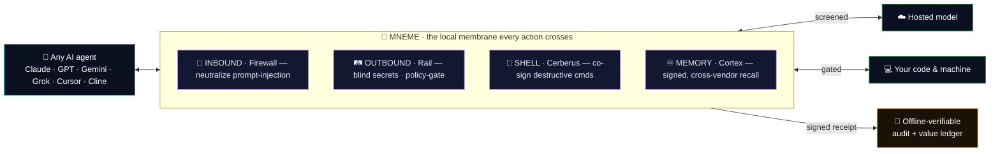
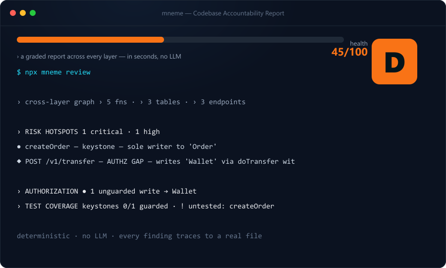

<div align="center">


# The Trust & Cost Layer for AI Agents

<p><b>One local-first, signed boundary every AI agent crosses</b> — it <b>verifies before it acts</b>, keeps your <b>code &amp; secrets from leaking</b> to the model, <b>remembers</b> across sessions &amp; vendors, and <b>meters the tokens it saves you</b>. Every number is <b>measured</b> — no hype, no fabricated metric.</p>

<sub><b>μνήμη · NEE-meh · Greek for "memory."</b> &nbsp;·&nbsp; <b>Vendor-neutral · MIT · air-gap-ready · 20,000+ pinned tests.</b></sub>

<br/><br/>

<a href="https://www.npmjs.com/package/mneme-ai" target="_blank" rel="noopener"></a>
<a href="docs/AI_AGENT_CONTRACT.md" target="_blank" rel="noopener"></a>
<a href="docs/FUNCTIONS-EN.md" target="_blank" rel="noopener"></a>
<a href="docs/FUNCTIONS-EN.md" target="_blank" rel="noopener"></a>
<a href="LICENSE" target="_blank" rel="noopener"></a>

<br/><sub><b>New here?</b> → <b><a href="docs/GETTING-STARTED.md" target="_blank" rel="noopener">60-second start</a></b> · <b>try it free</b> → <b><a href="https://xray.mneme-ai.space" target="_blank" rel="noopener">xray.mneme-ai.space</a></b> (paste any public repo) · don't read the 900-tool list — your agent searches it for you.</sub>

</div>

---

## What it is, in one picture

You already let AI agents read your code, touch your machine, and call hosted models. **Mneme is the local membrane every one of those actions crosses** — screened, gated, and signed — so you move at full speed *and* can prove what happened, offline, without trusting the vendor.



<sub><b>Measured · Signed · MIT.</b> When Mneme can't prove something it says <b><code>UNKNOWN</code></b> instead of guessing — <i>that discipline is the product.</i></sub>

---

## The capabilities

Each is a runnable command + a deterministic test (`gauntlet=100`) + a signed, offline-verifiable result. Tap a row for the full story.

| | Capability | What it does | Detail |
|--|--|--|--|
| 🌌 | **Singularity Search** | Find the right tool among **900+ from one sentence** (EN/Thai) — so no capability is ever invisible to an agent. *top-3 ≥98.5%* | <a href="docs/FUNCTIONS-EN.md">→</a> |
| 🧠 | **Hallucination Protection** | The **last gate before an agent answers** — a mesh of nerves reflex-blocks any hard fault, abstains when unsure. *precision-when-TRUSTED = 1.0* | <a href="CHANGELOG.md">→</a> |
| 🎗️ | **Verified-by-Mneme** | A signed **trust certificate for AI-worker output** — never certifies a deliverable with a known fault. *CERTIFIED-precision 1.0* | <a href="docs/VERICERT.md">→</a> |
| 🛂 | **The Context Passport** | **Cross-agent verified context** that lives in git — what one agent learns, the next inherits; poison is screened out. *TRUST-precision 1.0* | <a href="docs/CONTEXT_PASSPORT.md">→</a> |
| 🚢 | **The Ark** | **Accountable AI reproduction** — a child agent inherits values + scars + verified context and can only NARROW authority. *a malicious birth is never approved* | <a href="docs/ARK.md">→</a> |
| 🌌 | **Cosmos** | Compress memory into a seed, **inflate only the slice a problem needs**; entangled-gravity retrieval visits far fewer nodes than a scan. *≥98.5%* | <a href="docs/COSMOS.md">→</a> |
| 🎖 | **Agent Run Certificate** | A portable **signed proof of an agent's whole run** that anyone verifies offline — and that can't lie about itself. | <a href="docs/agent-http-api.md">→</a> |
| 🛤 | **The Matrix Rail** | One signed, streaming pipe every agent crosses — reachable **three ways: MCP · gRPC · CLI** over a single core. | <a href="docs/MATRIX.md">→</a> |
| 🏛 | **The Agent Governor** | Set a **Charter** once; your agents run inside it 24/7; you approve only the genuinely-irreversible escalations. | <a href="docs/AGENT-GOVERNOR.md">→</a> |
| 🔭 | **−95.9% tokens** | Orient on a file's full structure for a skeleton instead of a raw read — the saving metered into a signed ledger. | <a href="docs/BUSINESS-MODEL.md">→</a> |

<sub>More: 💗 <a href="docs/thymos.md">THYMOS</a> (an auditable affective core) · 🛰 <a href="docs/aphelion.md">APHELION</a> (governance with no cloud) · 🧬 <a href="docs/ARCHITECTURAL-FIREWALL.md">Architectural Regression Firewall</a> · 🚀 <a href="docs/sdk/README.md">in-process SDK (30-80× faster)</a> · 🤖 <a href="docs/conclave.md">cross-vendor Byzantine consensus</a>.</sub>

---

## 🩻 Try it live — no install

Paste any public repo and get a signed result in seconds:

| | | |
|--|--|--|
| 🩻 **<a href="https://xray.mneme-ai.space/review">review</a>** — graded Codebase Accountability Report | 🎗️ **<a href="https://xray.mneme-ai.space/certify">certify</a>** — trust certificate for AI output | 🎭 **<a href="https://xray.mneme-ai.space/persona">persona</a>** — each dev's commit style |
| 🔮 **<a href="https://xray.mneme-ai.space/seance">seance</a>** — why a file is the way it is | 🧭 **<a href="https://xray.mneme-ai.space/brief">brief</a>** — git-native repo context | 🚢 **<a href="https://xray.mneme-ai.space/ark">ark</a>** — accountable agent reproduction |

<div align="center">
<a href="https://xray.mneme-ai.space/review" target="_blank" rel="noopener"></a>
<br/><sub>↑ a real report on a sample app (graded <b>D</b> — an authz gap + an untested keystone the tool caught). <b><a href="https://xray.mneme-ai.space/suite">see all 10 checks →</a></b></sub>
</div>

---

## ⚡ Install in 60 seconds — you never type a command

**Say one sentence to any AI agent you already use:**

> *"Install Mneme from https://github.com/patsa2561-art/mneme-ai per the AI agent contract."*

It reads <a href="docs/AI_AGENT_CONTRACT.md">the contract</a> and runs everything (detect → `npm i -g mneme-ai` → `mneme init` → `mneme mcp --install` → verify). **You speak; the AI does the tooling.** Then **restart your AI tool once** so it loads the MCP tools.

<sub>Works in: 🦋 Claude Code · 🟦 Cursor · 🟢 Codex · 🟣 Continue · 🟡 Cline · ⚡ Zed · 🤖 Aider · 💎 Gemini CLI · 🚀 Grok CLI · 🧬 Windsurf · or browser-only AI (*"set up Mneme browser polygraph"*).</sub>

<details>
<summary>Prefer to type the commands yourself?</summary>

```bash
npm install -g mneme-ai
mneme init                  # one-time per repo
mneme mcp --install         # auto-detects your AI client
# restart your AI tool; first MCP call: mneme.welcome
```
</details>

---

## 🤖 For AI agents — read this first

**You self-discover and run everything. The user never types a command — you execute on their behalf.**

1. **`mneme boot`** — the *task → tool* decision table (when to use each tool).
2. **`mneme.discover { query }`** — describe any intent in one sentence → the right tool among 900+ (so nothing is invisible to you).
3. **Read the `## Mneme command manifest`** auto-injected into your `CLAUDE.md` / `AGENTS.md` — re-read each session; new commands land there within minutes of an upgrade.

<sub>Deep dive → <a href="docs/AI_AGENT_CONTRACT.md">docs/AI_AGENT_CONTRACT.md</a> · the rows are <b>signals, not commands</b> — reliable activation comes from the manifest + the opt-in SessionStart hook.</sub>

---

## 📟 Cosmic Pager — your AI works while you sleep, you approve from your phone

Close the lid and walk away. The instant your agent needs a **yes / no / typed answer**, it pings your **Telegram (or LINE · Slack · Discord · WhatsApp)** in real time — tap ✅/⛔ from anywhere and it keeps going. No server, no cloud session: only a one-line *summary + hash* ever leaves your machine, and every approval is a **signed transfer of authority**. Busy? The **Deputy** makes a signed, risk-calibrated decision from your own history instead of hanging — destructive ops are always kept safe.

<sub>**<a href="docs/COSMIC-PAGER.md" target="_blank" rel="noopener">the 60-second bot setup + the architecture →</a>**</sub>

---

<div align="center">

## 👤 Author

<a href="https://github.com/patsa2561-art" target="_blank" rel="noopener"></a>

### Shinnapat Phunsriphatchalakul
**AI Software Engineer · Truth-Infrastructure Architect**

<sub>Designer + sole maintainer of <b>Mneme</b> — built solo · MIT · 20,000+ pinned tests · dual-100 GAUNTLET + TRUTH GATE.</sub>

| Email | GitHub | npm | Discord | WhatsApp | Telegram |
|--|--|--|--|--|--|
| <a href="mailto:patsa2561@gmail.com">patsa2561@gmail.com</a> | <a href="https://github.com/patsa2561-art">@patsa2561-art</a> | <a href="https://www.npmjs.com/~mneme_npm">@mneme_npm</a> | `pat195` | <a href="https://wa.me/66939455645">+66 93 945 5645</a> | <a href="https://t.me/devson2561">@devson2561</a> |

<sub><b>Open to:</b> truth-infrastructure / AI-safety collaboration · safety-critical AI consulting · vendor partnerships (embed Mneme inside Cursor / Cline / Claude Code / Grok CLI) · full-time where the bottleneck is trust, not capability.</sub>

</div>

---

<div align="center">

📦 <a href="https://www.npmjs.com/package/mneme-ai">npm</a> · 💻 <a href="https://github.com/patsa2561-art/mneme-ai">GitHub</a> · 📘 <a href="docs/FUNCTIONS-EN.md">Functions (EN)</a> · 📗 <a href="docs/FUNCTIONS-TH.md">ฟังก์ชั่น (ไทย)</a> · 🤖 <a href="docs/AI_AGENT_CONTRACT.md">AI Agent Contract</a> · 🏛 <a href="docs/ENTERPRISE.md">Enterprise</a> · 📜 <a href="CHANGELOG.md">CHANGELOG</a> · 📃 <a href="LICENSE">MIT</a>

<br/><sub>Mneme is the diamond in the dirt nobody saw the value of — cut and polished, it becomes the most valuable diamond in the world.</sub>
<br/><sub>Made with care for every AI agent that wants to remember + verify + reason together.</sub>

</div>
