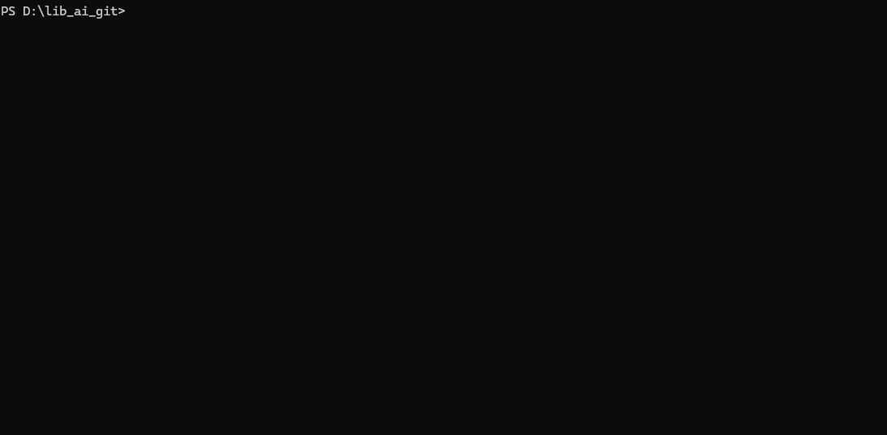

<div align="center">

<h1>μνήμη · Mneme</h1>

<p><b><i>What your codebase already knows.</i></b></p>

<p>
  Pronounced <code>NEE-meh</code> · Greek for "memory"<br/>
  <sub>sister of Lethe (forgetting), mother of the muses.</sub>
</p>

<p>
  <a href="https://www.npmjs.com/package/mneme-ai"></a>
  
  
  
  
  <a href="https://registry.modelcontextprotocol.io/"></a>
  <a href="https://github.com/patsa2561-art/mneme-ai/stargazers"></a>
</p>

<h3>The bug came back.<br/>
The fix from 2022 is in a commit nobody remembers.<br/>
<i>The author left.</i></h3>

<p>
  Mneme finds it in 50ms — with the diff, the rationale, and the related commits.<br/>
  <b>The same memory feeds your AI through MCP. With citations.</b>
</p>

<br/>



</div>

═══════════════════════════════════════════════════════════════════════════════

## ⏱ The 60-second story

You ship code with an AI assistant. The AI is brilliant — it reads syntax, infers types, autocompletes whole files. But there are **three things even the best AI cannot do**:

1. 🧠 **Remember why the code exists.** Six years of decisions, deprecations, and "we tried that, it broke X" — none of it is in the AI's context window.
2. 🔍 **Verify its own claims.** AI confidently says "no change to db.ts" — the diff shows three lines in db.ts. You merge. Production breaks.
3. 🛡 **Tell you when *another* AI is gaslighting you.** With Cursor + Claude Code + Codex all touching `git log`, **who is grading the homework?**

**Mneme is the layer underneath.** It's what gives your AI a memory. It's what verifies citations. And starting in **v0.27**, it's what audits every AI-driven commit with a vendor-neutral 5-axis trust certificate.

```bash
npm install -g mneme-ai             # zero-setup, bundled WASM, no API key
cd <any git repo>
mneme index                         # ~90s for 5k commits — one time

mneme ask "why does parseAmount use try/catch?"   # cited answer · refuses if unverifiable
mneme do "find security issues"                   # smart dispatcher · multi-step
mneme audit --certify                             # NEW v0.27 — grades the AI's homework
```

**The result your AI tools didn't know they were missing.** When Mneme is plugged in via MCP, your AI's answers get *measurably more grounded* — every claim cited, every contradiction caught, every AI commit certified before it merges.

> 🎯 **Mneme isn't a competitor to Claude Code, Cursor, or Codex.** It's the **teacher and the grader** they've been waiting for. Use whatever AI you love — Mneme makes it better.

### Before / With — what changes the moment Mneme is in your repo

| Scenario | Without Mneme | With Mneme |
|---|---|---|
| 🔍 *"Why does this code exist?"* | AI guesses from syntax | Cited answer with the original PR + rationale |
| 🤖 *AI says "no change to db.ts"* but diff edits db.ts | Merges silently | `mneme audit --certify` blocks the PR (exit 1) |
| 🛡 *AI commits 400 lines at 04:00 UTC* | Reviewed like any other PR | Forensic axes flag time + size anomaly |
| 📦 *50,000-commit monorepo + Sonnet 1M* | "context window exceeded" | HTC compresses to ~1.5M tokens, fits comfortably |
| 🆓 *No OpenAI/Anthropic key* | Tool refuses to work | Bundled WASM + free Ollama/Groq path runs full Q&A |

📅 [Full release history](https://github.com/patsa2561-art/mneme-ai/wiki/Releases) · [CHANGELOG](https://github.com/patsa2561-art/mneme-ai/blob/main/CHANGELOG.md)

═══════════════════════════════════════════════════════════════════════════════

## 🌟 v0.27 spotlight — `mneme audit`

> **The feature your AI tools wish they had.** *Vendor-neutral. Works with any AI that ends up in `git log`.*

When two or three AI assistants are all editing the same repo, **someone has to grade the homework.** Mneme is that someone. Not a competitor to Claude Code or Cursor — the layer they answer to.

### 30-second story

Your AI commits: *"I refactored the handler. **No changes to db.ts.**"*<br/>
The diff actually touches `db.ts`. Tests pass. You almost merge.

`mneme audit --certify` catches it **before** merge:

```
⚠ ai-narrative-mismatch  1 contradiction
   AI claimed:  "No changes to db.ts"
   Reality:     db.ts modified (+3 -0)
   Verdict:     contradicted

OVERALL: ⊘ FAIL  (exit code 1 → CI gate refuses the PR)
```

### Five axes, scored in parallel

| # | Axis | What it asks |
|---|---|---|
| 1 | 🎯 Behavioral parity | Did `mneme status / npm test` produce the same output? |
| 2 | 📐 API contract drift | Did exported types disappear? |
| 3 | ✅ Test pass rate | Anything that passed before now fails? |
| 4 | ⚡ Perf regression | Median latency vs baseline *(>25% slower → fail)* |
| 5 | 📰 AI narrative | Commit-message claims vs actual diff |

Plus forensic axes (TIME / FILES / STYLE / SIZE) — same anomaly engine Mneme runs on humans, applied to **every AI vendor auto-detected**: Claude Code · Cursor · Codex · Devin · Sweep · Aider · Copilot.

### Six modes — copy-paste flow

```bash
mneme audit --baseline      # snapshot behavior BEFORE the AI works
mneme audit --trace         # diff + AI-vendor detection
mneme audit --verify        # narrative vs reality (Leviathan-style)
mneme audit --certify       # 5-axis trust cert · CI-friendly exit code
mneme audit --watch         # continuous CI gate
mneme audit --report        # markdown audit trail (SOX / SOC2)
```

### Why even AIs respect this

- **Vendor-neutral.** Adding a new AI = one regex line. We audit whatever the AI claims it is.
- **Composable.** Reuses HTC compressed memory + Leviathan verifier + forensic anomaly engine + Iris pyramid renderer + SuperPipeline + MPE — primitives no other tool ships together.
- **Falsifiable.** Pure rule-based + statistical primitives. **No "AI grading AI" loops.**
- **Honest.** "No change to db.ts" is parseable. "Improved overall reliability" is `unverifiable` — we say so, don't pretend.

→ **[Full positioning · 6 modes · CI integration · compliance →](https://github.com/patsa2561-art/mneme-ai/wiki/AI-Session-Audit)**

═══════════════════════════════════════════════════════════════════════════════

## 🧠 The brain — five lobes (click any to expand)

Mneme's intelligence is split into 5 cognitive modules. Each is independently useful and composable. **Click a lobe to see how it thinks.**

<details>
<summary><b>📦 Hierarchical Memory (HTC)</b> — compress 50,000 commits into one Claude prompt · <i>world-first compression-as-storage</i></summary>

Every AI codebase tool today (Cody, Greptile, Cursor, Sweep, Aider) is **retrieval-only**. They search your repo at query time and dump raw text into the LLM. That breaks at scale.

Mneme inverts the model: at index time, **free LLMs (Groq Gemma 2B / Ollama Qwen) walk every commit** and produce three layers of compression:

| Layer | Size per unit | What it stores |
|---|---|---|
| Layer 1 — abstracts | ~30 tok / commit | per-commit "WHAT changed + WHY" |
| Layer 2 — clusters | ~100 tok / cluster | topic-level summaries |
| Layer 3 — memoir | ~500 tok | repo-evolution narrative |

Token math on a 50K-commit repo:

```
raw commit text     ~50M tokens   (won't fit anywhere)
compressed cache    ~1.5M tokens  (fits in Sonnet 1M context, comfortably)
compression ratio   ~33×
```

```bash
mneme htc-build        # one-time compression (~10 min for 5k commits, free LLM)
mneme htc-stats        # see coverage + compression ratio
```

**Used automatically by `mneme ask` when cache is built.** AI clients via MCP get compressed responses by default — `compress: false` to opt back into raw. ~10× fewer tokens per session.

→ [[Wiki: Hierarchical-Memory]](https://github.com/patsa2561-art/mneme-ai/wiki/Hierarchical-Memory)

</details>

<details>
<summary><b>🔬 Speculative Reasoning</b> — see Mneme think · verify every claim · DDTree commit-tree search</summary>

Most "AI codebase tools" are black boxes — input goes in, answer comes out, you trust the output. Mneme inverts this: every commit considered, every claim verified, every prune explained.

```bash
mneme ask "why was JWT chosen?" --stream
```

Output streams events in real time:

```
⚙ consider abc1234  "auth: switch session → JWT"        score 0.84
✓ accept   abc1234  above score floor
⚙ consider def5678  "auth: add CSRF guard"               score 0.41
✗ prune    def5678  below topK cut
✦ synthesize from 2 verified citations…
✓ verify    "JWT was chosen for stateless tokens"   ✓ matches PR #482 body
✗ verify    "session storage caused issues at scale" ⚠ unverifiable claim
✓ done      in 312ms
```

**Five primitives ship together (v0.23):**
1. Streaming events — `consider / accept / prune / contradict / verify`
2. **Leviathan citation verifier** — adapted from the speculative-decoding paper. Every claim's hash + sentence verified against evidence. Unverified claims wrapped `[unverified: ...]`.
3. **DDTree commit-tree search** — best-first ancestor exploration with budget + depth caps
4. **ConstraintPruner trait** — pluggable validators (CWE / ENFSI / 4-axis / custom)
5. **Path-aware sessions + wisdom-mutant** — Q2 search constrained by Q1's commits; provider success rates auto-evolve

→ [[Wiki: Speculative-Reasoning]](https://github.com/patsa2561-art/mneme-ai/wiki/Speculative-Reasoning)

</details>

<details>
<summary><b>⚡ Super Pipeline + MPE math</b> — deeply-pipelined-superscalar engine · 1.56× throughput · novel formula</summary>

Modern CPUs combine deep pipelining (~20 stages, fast clock) with superscalar (multiple parallel pipelines). Mneme v0.26 brings the same architecture to its retrieval flow — and adds a self-tuning trust eigenvector no other CLI tool ships.

**The novel math (MPE — Multi-stage Pipelined Eigentrust):**

```
T_n = α × E_n × T_{n-1} + (1-α) × prior

  E_n[s] = exp(-latency / target)   on success
  E_n[s] = 0                         on failure
  α      = 0.85   (PageRank decay)
  prior  = 1/N    (uniform exploration)
```

Combines **Eigentrust** (Kamvar et al. 2003) + **PageRank decay** + **Bayesian online updates** + **pipeline scheduling**. After ~20 production calls, T converges to a stable per-stage trust ranking. Pipeline auto-allocates more workers to high-trust slow stages, fewer to low-trust ones, disables speculative pre-fetch when trust is unsafe.

**Throughput benchmark** (4-stage pipeline, 8 inputs, 12ms/stage):

```
sequential (width=1, buffer=1) = 168 ms
pipelined  (width=2, buffer=4) = 108 ms
speedup                        = 1.56×
```

→ [[Wiki: Super-Pipeline]](https://github.com/patsa2561-art/mneme-ai/wiki/Super-Pipeline)

</details>

<details>
<summary><b>🛡 Guardian + AI Audit</b> — 24/7 self-healing · always-on pre-commit hook · vendor-neutral AI session audit (NEW v0.27)</summary>

**Three layers of "always-on" protection:**

1. **Guardian** (v0.16) — 24/7 self-healing daemon. Diagnoses index drift, weak embeddings, schema staleness; auto-fixes safe items, recommends the rest.
   ```bash
   mneme guardian --watch --apply --interval 300
   ```

2. **`mneme guard`** (v0.20) — pre-commit hook. Install once → blocks commits with hardcoded secrets or CWE-aligned vulnerability patterns. <300ms per commit. Bypass with `git commit --no-verify`.
   ```bash
   mneme guard --install
   ```

3. **`mneme audit`** (v0.27, NEW) — AI Session Audit. **Vendor-neutral** trust certificate for every AI-driven commit. Works with Claude Code · Cursor · Codex · Sweep · Aider · any tool ending up in `git log`.
   ```bash
   mneme audit --baseline      # snapshot before AI works
   #  → AI does its thing →
   mneme audit --certify       # 5-axis pass/warn/fail · CI-friendly exit code
   ```

   The 5 axes: **behavioral parity · API contract drift · test pass rate · perf regression · AI narrative match**. Plus reuses Mneme's forensic anomaly engine (TIME / FILES / STYLE / SIZE) on AI commits.

→ [[Wiki: Guardian]](https://github.com/patsa2561-art/mneme-ai/wiki/Guardian) · [[Wiki: AI-Session-Audit]](https://github.com/patsa2561-art/mneme-ai/wiki/AI-Session-Audit)

</details>

<details>
<summary><b>🔬 Forensic Code Science</b> — Bayesian author attribution · ENFSI verbal scale · CWE vuln hunt · insider-threat anomaly</summary>

Real forensic-science methodology applied to git history — not a metaphor. **Bayesian likelihood ratios** (Did Alice really write this commit?). **ENFSI 2015 verbal scale** (the same standard used in court). **11 CWE-aligned** vulnerability classes. **4-axis insider-threat detection** (TIME × FILES × STYLE × SIZE). Built for bank / finance / regulated-industry engineering oversight.

```
LR = 3.87e-13   (~1 in 2.6 trillion — overwhelming AGAINST authorship)
                 EXTREMELY STRONG SUPPORT AGAINST
```

Every output is plain-English with a `HEADS UP` warning when the repo is too small / single-author for statistically meaningful forensics — no false-positive theater.

→ **[Full forensic toolkit + CWE classes + ENFSI scale → Wiki](https://github.com/patsa2561-art/mneme-ai/wiki/Forensic-Code-Science)**

</details>

═══════════════════════════════════════════════════════════════════════════════

## 🎓 Manifesto — Mneme is the teacher of AI

> AI is genius. Mneme is the master that teaches the genius.

Most AI tools position themselves as **better students** — better-trained models, bigger contexts. They compete on the same axis. **Mneme positions on a different axis: quality of teaching.** We don't compete with the AI; we make whatever AI you choose **measurably better** via MCP.

Practical consequence: every Mneme release **lifts every AI tool** that integrates. We're a force multiplier across the entire ecosystem, not a participant in any one tool's competition.

→ [[Wiki: AI-Teacher]](https://github.com/patsa2561-art/mneme-ai/wiki/AI-Teacher) — five teaching mechanisms documented.

═══════════════════════════════════════════════════════════════════════════════

## 💎 The Frontier — 23 capabilities no other tool ships

After researching the landscape (Sourcegraph Cody, Greptile, Cursor, Continue, Sweep, Aider, Copilot Workspace), every command in this list occupies whitespace where **no maintained, open-source, local-first tool ships this capability today.**

→ 📋 **[Full table → Wiki: The Frontier](https://github.com/patsa2561-art/mneme-ai/wiki/The-Frontier)**

> 🛡 *Built to complement existing AI coding assistants — not to replace them.*

═══════════════════════════════════════════════════════════════════════════════

## 🚀 Install

<details>
<summary><b>Pick one of three ways</b></summary>

| Pick this if you… | Command |
|---|---|
| 🔬 want to **try without installing** anything | `npx -y mneme-ai init` |
| 💼 plan to **use it daily** *(recommended)* | `npm install -g mneme-ai` |
| 🛠 want to **contribute or run latest code** | `git clone …/mneme-ai && cd mneme-ai && npm install && npm run build` |

After install, the same 60-second flow on any git repo:

```bash
mneme init                       # creates .mneme/ inside the repo
mneme index                      # ~90s for 5k commits, zero-setup since v0.19
mneme ask "why does X exist?"    # query the memory
```

**Upgrade:**

```bash
mneme upgrade                       # v0.22.2+ — bulletproof self-update
                                    # bypasses npm cache + diagnoses PATH conflicts
```

</details>

<details>
<summary><b>🆓 Free Forever — no API key required</b></summary>

Indexing works zero-config (bundled WASM, ~25MB auto-download).

For full Q&A synthesis, run the 30-second wizard:

```bash
mneme setup-free
```

Three free paths:

| Path | What you get | Setup time |
|---|---|---|
| 🏠 **Local Ollama** | 100% private, free forever, ~3GB one-time | ~3 min |
| ⚡ **Groq free tier** | 500 tok/s cloud (fastest), generous free quota | ~30 sec |
| 🌐 **OpenRouter free** | Model variety: Qwen, Gemma, Llama 3.3 | ~30 sec |

**Auto-detected.** Set `GROQ_API_KEY`, `OPENROUTER_API_KEY`, `TOGETHER_API_KEY`, or run local `ollama serve` — Mneme picks the right path. **Models known to work free:** Llama 3.3 70B · Qwen 2.5 (3B/7B/72B) · Qwen QwQ 32B · Gemma 2 (2B/9B) · Llama 3.1/3.2.

If everything fails, retrieval-only fallback still answers — never a hard error.

</details>

═══════════════════════════════════════════════════════════════════════════════

## ⚡ Try it

<details>
<summary><b>Five commands to start</b></summary>

```bash
mneme ask "why does parseAmount use try/catch?"
#  → verdict-shaped answer, citation-grade

mneme why src/auth.ts:47
#  → who wrote each line + why · semantically related commits

mneme premortem "swap event-bus library"
#  → predict regret risk grounded in YOUR repo (not generic best-practices)

mneme story "rate-limiting"
#  → narrative across all commits touching the topic

mneme ask --audit "..."
#  → zero-hallucination mode · refuses if confidence below floor
```

</details>

<div align="center">

<table>
<tr>
<td align="center" width="100%">

### 📚 The full command browser — **50+ commands, every one with examples**

<sub>Tier 1 essentials · Forensics · Quant · Insights · MCP · v0.27 Audit</sub>

<br/>

[**🔍 Browse all commands in the wiki →**](https://github.com/patsa2561-art/mneme-ai/wiki/Command-Tour)

<sub>plain-English use case · copy-paste examples · graphics · grouped by category</sub>

</td>
</tr>
</table>

</div>

<details>
<summary><b>🤖 Tell your AI to install it (one prompt)</b></summary>

Copy-paste this into Claude Code / Cursor / Codex / Continue / Cline:

```
Install mneme-ai globally with npm, then run `mneme init` and `mneme index`
in this repo. Then add the Mneme MCP server to your config so you can call
`mneme_ask`, `mneme_search_commits`, `mneme_why`, and `mneme_status` as
tools. The MCP transport is stdio; the command is `mneme mcp` from this
repo's root.
```

The AI will figure out the rest (npm install, MCP config edits, smoke-test). Works because Mneme is **registered in the official MCP Registry**.

</details>

═══════════════════════════════════════════════════════════════════════════════

## ❓ FAQ

<details>
<summary><b>Common questions (click to expand)</b></summary>

**Q: Can I just prompt my AI agent to run `git log` instead?**
A: Yes — for small repos with simple queries. Mneme starts adding value when **scale, semantics, forensics, or audit** matter — see [the comparison table](https://github.com/patsa2561-art/mneme-ai/wiki/Innovations#vs-ai--git-cli) for the 9 cases.

**Q: Does Mneme replace Claude Code / Cursor / Codex?**
A: No. Mneme is a **memory layer underneath them**. Plug Mneme's MCP server into your AI client and it gains semantic codebase memory + forensic tools.

**Q: Do I need Ollama or an OpenAI key?**
A: No. Bundled WASM model handles indexing zero-config. For full Q&A synthesis, `mneme setup-free` walks you through 3 free paths in 30 seconds.

**Q: Does my code leave my machine?**
A: No. Indexing + retrieval are **100% local**. Only your AI client (if cloud-based) sees what *you* decide to send it.

**Q: How accurate is the forensic analysis?**
A: Pattern matching produces **candidates**, not certified findings — every hit needs human review. Forensic methodology follows the **ENFSI 2015 verbal scale** (real forensic standard). See [Forensic-Code-Science](https://github.com/patsa2561-art/mneme-ai/wiki/Forensic-Code-Science).

**Q: Will it work on a 50,000-commit monorepo?**
A: Yes. Indexing is incremental. With `mneme htc-build` (v0.24) the entire history fits in one Claude prompt as compressed abstracts.

**Q: What if I'm offline / on a plane?**
A: After the first run (one-time 25MB model download), everything works offline. Hash fallback works even without the bundled model.

</details>

═══════════════════════════════════════════════════════════════════════════════

## 📦 Project links

<table>
<tr><td>📦 <b>npm</b></td><td><a href="https://www.npmjs.com/package/mneme-ai">npmjs.com/package/mneme-ai</a></td></tr>
<tr><td>💻 <b>GitHub</b></td><td><a href="https://github.com/patsa2561-art/mneme-ai">github.com/patsa2561-art/mneme-ai</a></td></tr>
<tr><td>📚 <b>Wiki</b></td><td><a href="https://github.com/patsa2561-art/mneme-ai/wiki">Mneme's brain map</a></td></tr>
<tr><td>📋 <b>CHANGELOG</b></td><td><a href="https://github.com/patsa2561-art/mneme-ai/blob/main/CHANGELOG.md">version-by-version detail</a></td></tr>
<tr><td>🔌 <b>MCP Registry</b></td><td><code>io.github.patsa2561-art/mneme-ai</code></td></tr>
</table>

═══════════════════════════════════════════════════════════════════════════════

## 📜 License

MIT. Use it. Fork it. Ship it.
Quoting [Christensen](https://www.harvardbusiness.org/its-easier-to-hold-to-your-principles-100-of-the-time-than-it-is-to-hold-to-them-98-of-the-time/):

> *"It's easier to hold your principles 100% of the time than it is to hold them 98% of the time."*

Mneme's principles are non-negotiable: local-first · free path always works · verifiable-or-refuse · plain English everywhere · **AI is the student; we are the teacher.**
